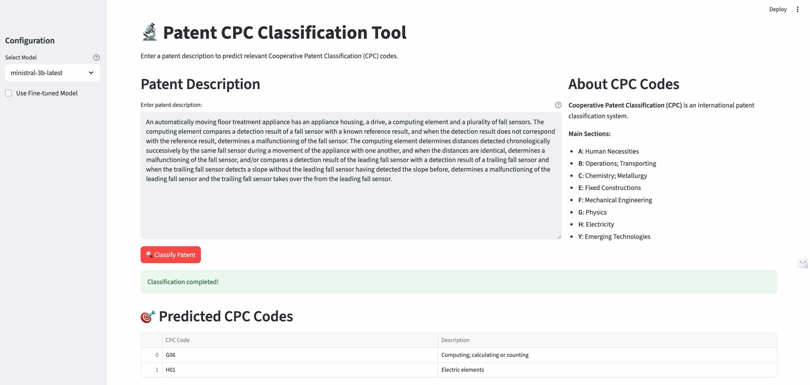

# Mistral Fine-tuning for Patent Classification

A machine learning project for fine-tuning Mistral models to classify patents using Cooperative Patent Classification (CPC) codes.

Link to presentation: [presentation](https://docs.google.com/presentation/d/1BcU-9KFheY6PNxzbUjubFserr5G1Kl--sah8C26cewU/edit?usp=sharing)

## Overview

This project fine-tunes Mistral models for multilabel classification, automatically assigning patent applications to relevant CPC class-level codes. The system analyzes the patent text and predicts all appropriate classification codes reflecting the invention’s technical content.

## CPC Classification

The system classifies patents into the 48 most common CPC class codes, which are grouped into 8 main sections:
- **A**: Human Necessities
- **B**: Performing Operations; Transporting
- **C**: Chemistry; Metallurgy
- **E**: Fixed Constructions
- **F**: Mechanical Engineering; Lighting; Heating; Weapons; Blasting
- **G**: Physics
- **H**: Electricity
- **Y**: General tagging of new technological developments

## Project Structure

```
├── data/                    # Training, validation and test datasets
├── prompts/                 # System and user prompts used for base model inference
├── results/                 # Model inference results
├── batch_inference.py       # Script for batch inference with Mistral's base models
├── eval.py                  # Script for evaluation metrics calculation
├── finetuning.ipynb        # Fine-tuning notebook
├── preprocess_data.ipynb   # Data preprocessing notebook
├── patent_classifier_ui.py # Interactive patent classification UI
└── requirements.txt        # Python dependencies
```

## Installation

1. Install dependencies:
```bash
pip install -r requirements.txt
```

2. Set up your Mistral API key:
```bash
export MISTRAL="your-api-key-here"
```
3. Set up your Weights & Biases API key (optional but recommended for finetuning):
```bash
export WANDB_API_KEY="your-api-key-here"
```

## Interactive Patent Classification UI

The `patent_classifier_ui.py` provides a user-friendly Streamlit interface for classifying patent descriptions into CPC codes.

```bash
# Run the UI
streamlit run patent_classifier_ui.py
```


## Data Preprocessing

The `preprocess_data.ipynb` notebook contains the complete data pipeline for preparing patent classification datasets. It shows how raw patent data was fetched, cleaned, and preprocessed into training-ready formats.

**Key Steps**:
- Data fetching from patent databases
- CPC label extraction and sampling patents from top 48 CPC classes
- Patent text truncation to fit into model input length
- Dataset splitting (train/validation/test)
- Format conversion for fine-tuning

## Fine-tuning

Use `finetuning.ipynb` to fine-tune Mistral models via the Mistral fine-tuning API to improve classification performance beyond prompt-based approaches.

**Key Features**:
- Model configuration and hyperparameter setup
- Upload training and validation data to Mistral API
- Kick-start fine-tuning process with loss monitoring
- Integration with Weights & Biases for experiment tracking
- Inference with fine-tuned model

## Batch Inference with Base Models

The `batch_inference.py` script runs inference on datasets using Mistral's batch API for **base models only** (not fine-tuned models). It enables efficient baseline testing of base models and processes multiple samples simultaneously instead of sample-by-sample classification. It can process either raw patent data or pre-processed batch inference files.

**Arguments**:
- `--raw_input_file, -i`: Path to raw input JSONL file containing `patent_desc_trunc` field
- `--processed_input_file, -p`: Path to pre-processed JSONL file with `custom_id` and `body` fields
- `--results_file, -r`: Output path for results (default: `results/batchinf_results.jsonl`)
- `--sys_prompt, -s`: System prompt file for processing raw input file (default: `prompts/sys_prompt_zero.md`)
- `--user_prompt, -u`: User prompt file for processing raw input file (default: `prompts/user_prompt_zero.md`)
- `--model, -m`: Mistral model name (required)

**Examples**:
```bash
# Using raw input file (will be processed with prompts)
python batch_inference.py -i data/raw_test_data.jsonl  -m ministral-3b-latest

# Using pre-processed batch inference file
python batch_inference.py -p data/batchinf_test_data.jsonl -m ministral-3b-latest

# Custom prompts
python batch_inference.py -i data/raw_test_data.jsonl -s custom_sys.md -u custom_user.md -m ministral-3b-latest
```

## Evaluation

The `eval.py` script calculates comprehensive multi-label classification metrics to assess model performance on patent classification. It evaluates model predictions against ground truth labels and generates detailed performance metrics, including identification of     weak-performing classes.

**Evaluation Metrics**:
- **Hamming Loss**: Multi-label classification accuracy
- **Subset Accuracy**: Exact match accuracy
- **Micro/Macro F1**: Precision and recall metrics
- **Jaccard Index**: Similarity between predicted and true labels
- **Hallucination Rate**: Percentage of invalid predictions 
- **Per-class F1**: Individual class performance

**Arguments**:
- `--model, -m`: Model name for tracking (default: `ministral-3b-2410`)
- `--results, -r`: Path to inference results JSONL file (required). Must have `custom_id` and `pred_class_ids` or `response` fields 
- `--test_data, -t`: Path to test data JSONL file with ground truth. Must have `cpc_class_ids` field (default: `data/df_test_final.jsonl`)
- `--ft_notes, -f`: Notes about fine-tuning settings (optional)
- `--data_notes, -d`: Notes about train dataset (optional)

**Examples**:
```bash
# Basic evaluation
python eval.py -r results/batchinf_results.jsonl -m ministral-3b-latest

# Evaluation with detailed tracking
python eval.py -r results/batchinf_results.jsonl -m ministral-8b-latest -f "epochs=3, batch_size=16" -d "cleaned_patents_v2"
```

**Output**: 
- Prints detailed metrics to console
- Appends results to `metrics.csv` for tracking experiments
- Identifies weak classes (F1 < 0.5) for further analysis

### Results Visualization

Use the `viz_results.ipynb` notebook to visualize and compare model performance across different experiments. Open `viz_results.ipynb` in Jupyter and run all cells after populating `metrics.csv` with evaluation results.


